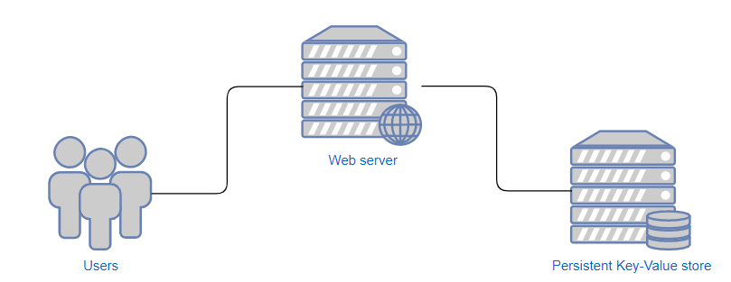
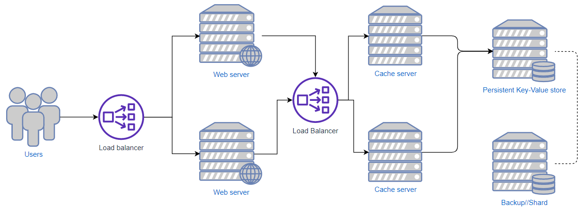

# URL Shortener
## To run:
If you want to run this locally, the easiest way is:
```
docker-compose -f docker/run-local-compose.yml up
```
Visit http://localhost:8080 in your browser to use it. Ensure you have this port free.
It will say "Unable to connect to url" a few time in the console; this is normal, it takes a second for all the
servers to spin up and get connected

If you do not want to use docker, ensure you have go installed and then run:
```
cd <git directory>
mkdir bin
go build -o ./bin/dbserver ./go/servers/db/main.go
go build -o ./bin/cacheserver ./go/servers/cache/main.go
go build -o ./bin/webappserver ./go/servers/webapp/main.go
./bin/dbserver & ./bin/cacheserver & ./bin/webappserver
```
Visit http://localhost:8080 in your browser to use it.
Ensure ports `8080`, `8081`, and `8082` are free or use the `-port=<num>` flag to set ports for each server, as well as setting the appropriate hosts.
Use the `-h` flag for help.

If you want to test the deployment, ensure you have terraform installed and then run:
```
cd terraform
terraform init
terraform apply
```
And follow the prompts. This will create 3 t2.micro servers, so be sure to call terraform destroy when finished.

I have also deployed this project to http://3.142.135.164/ for the time being. You should be able to use the application there.
Be sure to type the full url and protocol, eg: `http://google.com`

# Description, methodologies, etc.
Overall this was an interesting project for me. I did not expect such a simple application to have a vast number of viable approaches.
Here I will outline my approach, as well as what I would recommend for various levels of scale

## Basics
Let's look at the problem further. The explicit requirement are:
1. Users can shorten urls
2. Users can visit shortened urls and be redirected to the correct webpage

There are also some implicit requirements:
1. It should not take too long to redirect or shorten urls
2. There should be a reasonable expectation of privacy
   
Number 2 is a little ambiguous as different people have different notions of privacy.
For me, all this meant was that if a user creates a shortened url, they can at least expect that some nefarious user cannot trivially access it.
It would be unreasonable to expect that the url have some additional layer of security without at least requesting such a feature first.
I will go into more detail on this later as well.

## Approach
The big problem we need to solve can essentially be boiled down to two things
1. We need some sort of key-value store that is persistent and fast
2. We need some way to generate keys

There are many ways to accomplish the key value store. I will highlight a few:
- You can use a simple persistent key-value storage application, and then apply a rendezvous hashing scheme to distribute the storage among nodes.
  This is important when you are dealing with a very large number of urls
- You can go all out and use a sharding database like Apache Cassandra. This is way overkill, but will be quite reliable as you are using a well known software package

To generate keys, there are also many approaches. Here are three that I found interesting:
- Generate keys at the main database. This has the benefit of being simple, fast, and easy to understand. The downsides of this are hard to see.
  If you are using a key generating service based on randomness with a known period (eg. Mersenne Twister) you can confidently generate keys for (essentially) eternity
  with almost no worries. However if you don't have such a scheme, then the next option is more flexible
- Use a separate key generation service. This has an added layer of flexibility, at the cost of some data duplication and complexity.
  However, the complexity is not entirely unfounded: adding additional layers such as caching can be made easier with a separate key generation service.
  In general, regardless of which of these two approaches you choose, key generation should be kept as isolated as possible to make it easy to add additional features
- You can use a symmetric encryption to generate keys. To explain this, consider the following approach:
  - Generate keys in a sequence, eg. first request gets url `domain.com/0000000` and so on
- Obviously this approach violates the privacy requirements highlighted above, but the benefit is that we don't even need a key value store any more to use this:
  it's just an append only array!
- We can easily modify this approach to suit privacy as well:
  - Generate keys in a sequence. Then pass the keys through a symmetric encryption and give that to the user.
    When redirecting a user to a specific site, first decrypt the key they provided and then index that key into the array
- This fulfills the privacy requirement and is insanely fast (probably unnecessarily fast), but comes at some costs:
  - Low flexibility: you cannot add a feature like custom urls easily
  - If someone were to crack or steal the encryption key, you cannot change it, and the privacy is lost
- An approach like this is only suitable for highly specific requirements, but I thought it was worth mentioning

The approach I chose in this repository was to use a simple key value store, and use a random number generator combined with a Base62 encoding to make keys.
I have kept the key generation isolated, and as a result have also added a caching layer with little difficulty. I did not implement rendezvous hashing, however.
Thankfully, you can always add approaches like rendezvous hashing/consistent hashing in the future if need be, with little to no downtime.

My caching layer can serve both redirect requests and url creation requests.
I do this by having the cache servers ask the main server for some number of keys beforehand (eg. 1000) which expire in 24 hours.
Then, to fulfill a request, the cache server can immediately provide a shortened url and then forward the request to main server asynchronously.
To the user, they will see the update immediately and can even share it to some people immediately. After the request hits the main server,
everyone will be able to see use the shortened URL.

## Scale
Here is what a very simple setup could look like:



The users connect to some Web server, and that web server queries the database.
This setup can work on a small scale with localized users (eg. within a medium sized company)

A more sophisticated setup to serve more users could be:



This is the setup I implemented, save for the load balancers and sharding. This should operate very well at the intranational/region level.
You can easily spin up a large number of cache servers to improve performance significantly.

To operate at the global level, there are a few options. You can try to spin up cache servers in regions overseas, but this is not a long term solution

Another idea is to have the cache servers communicate to each other as a swarm. This way, each server gets very high utilization and changes can be spread
throughout a region without needing to duplicate the main database overseas as well. It is very difficult to say whether this approach is sufficient.
I believe that given typical url shortening usage is in a burst: a user creates a shortened link, shares it, and it gets used a bunch of times.
After a while, the link dies out and is either never used or only occasionally. For this sort of usage, this setup may be good enough.

However, if the overseas usage is very high, you can duplicate the main server there, add some cache servers, and have them communicate with each other to sync
the new urls. This is expensive, but is indeed the most robust way to handle very high load.

## Implementation details
For my implementation I used:
- Development:
  - Golang for the server
    - Go is excellent and proven for server side development. It comes with an excellent standard library, and is a joy to program in.
      I always choose Go for this type of work if I can.
  - Badger-DB for the key value store
    - Native Golang implementation keeps things simple
    - Fast and proven for large (terabyte) level data
- Deployment:
  - Terraform for provisioning
    - This is what was mentioned was used at Unity, and I also quite like it. Overall it was a good experience.
      I had a few issues with the state not being cached correctly, as well as some misguided online tutorials, but I made it work
  - Docker for deploying to the server
    - I originally planned to use Ansible, but it does not run on Windows and setting it up/using it was a large hassle
      This is not insurmountable of course, but I looked into other options
    - While looking, I did some research on how large companies deploy code, and I found this very nice article: https://hackernoon.com/configuration-management-is-an-antipattern-e677e34be64c
    - To summarize, it basically said that using images was the most robust and easiest way to do deployments
    - After using docker it became immediately obvious that this was the right way to go.
      I could easily deploy the code with almost no hassle as far as making it run remotely
    - This is not exactly the best way: the most robust method is to create full machine images (eg. Amazon Machine Images using a tool like packer)
    - This is because docker usage is not free: there is a performance hit, and docker can crash and interfere with database data recovery
    - I went with docker anyway for two reasons:
      1. The information on this subject was highly contradictory and it did not seem clear cut which way to go
      2. Building and deploying machine images without losing the database data is not simple, and requires advanced setup on Amazon's side I could not afford

I did not implement proper logging, but I would recommend something like Apache Kafka to store and manage logs.